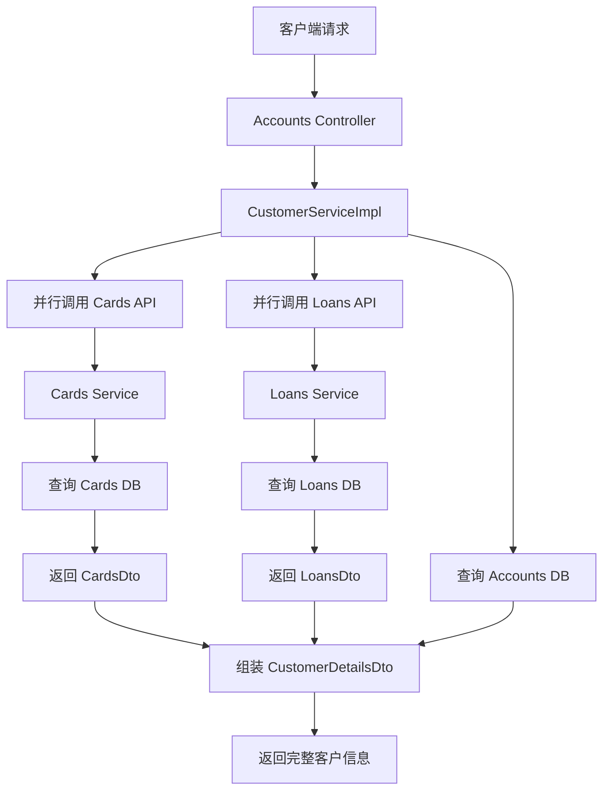

# Section2_1 - 银行微服务项目

## 📋 项目概述

Section2_1 是一个基于 Spring Cloud 的银行微服务系统，采用分布式架构设计，包含账户管理、卡片管理和贷款管理三个核心业务微服务。项目通过 common 模块实现代码共享和统一管理，使用 Feign Client 进行微服务间通信。

### 核心特性

- ✅ **微服务架构**：独立的 accounts、cards、loans 微服务
- ✅ **服务发现**：Eureka 服务注册与发现
- ✅ **声明式 HTTP 客户端**：OpenFeign 微服务调用
- ✅ **统一异常处理**：common 模块共享异常体系
- ✅ **并行调用优化**：CompletableFuture 提升性能
- ✅ **API 文档**：SpringDoc OpenAPI (Swagger)
- ✅ **数据验证**：Jakarta Validation
- ✅ **ORM 框架**：Spring Data JPA + Hibernate

---

## 🏗️ 项目架构

### 整体架构图

```
┌─────────────────────────────────────────────────────────┐
│                    API Gateway (可选)                      │
└──────────────┬──────────────┬──────────────┬────────────┘
               │              │              │
    ┌──────────▼───┐  ┌──────▼──────┐  ┌───▼──────────┐
    │   Accounts   │  │   Cards     │  │   Loans      │
    │  Microservice│  │Microservice │  │ Microservice │
    │  (Port 8080) │  │(Port 9000)  │  │(Port 8090)   │
    └──────────┬───┘  └──────┬──────┘  └───┬──────────┘
               │              │              │
               └──────────────┼──────────────┘
                              │
                   ┌──────────▼──────────┐
                   │   Common Module     │
                   │  (共享组件库)        │
                   └─────────────────────┘
                              │
                   ┌──────────▼──────────┐
                   │  Eureka Server      │
                   │  (服务注册中心)      │
                   └─────────────────────┘
```

### 微服务调用流程



---

## 📁 项目结构

```
section2_1/
├── accounts/                          # 账户微服务
│   ├── src/main/java/org/yiqixue/accounts/
│   │   ├── controller/                # REST 控制器
│   │   ├── service/                   # 业务逻辑层
│   │   │   ├── impl/                  # 服务实现
│   │   │   └── client/                # 微服务客户端
│   │   ├── repository/                # 数据访问层
│   │   ├── entity/                    # JPA 实体类
│   │   ├── dto/                       # 数据传输对象
│   │   ├── mapper/                    # 对象映射器
│   │   ├── exception/                 # 异常处理
│   │   ├── constants/                 # 常量定义
│   │   └── audit/                     # 审计功能
│   └── pom.xml
│
├── cards/                             # 卡片微服务
│   ├── src/main/java/org/yiqixue/cards/
│   │   ├── controller/
│   │   ├── service/
│   │   ├── repository/
│   │   ├── entity/
│   │   ├── dto/
│   │   ├── mapper/
│   │   ├── exception/
│   │   ├── constants/
│   │   └── audit/
│   └── pom.xml
│
├── loans/                             # 贷款微服务
│   ├── src/main/java/org/yiqixue/loans/
│   │   ├── controller/
│   │   ├── service/
│   │   ├── repository/
│   │   ├── entity/
│   │   ├── dto/
│   │   ├── mapper/
│   │   ├── exception/
│   │   ├── constants/
│   │   └── audit/
│   └── pom.xml
│
├── mybank-bom/                        # 父 POM 和公共模块
│   ├── common/                        # 共享组件库
│   │   ├── src/main/java/com/yuqixue/common/
│   │   │   ├── constants/             # 通用常量
│   │   │   ├── dto/                   # 通用 DTO
│   │   │   ├── exception/             # 通用异常
│   │   │   ├── feign/                 # Feign 客户端
│   │   │   └── utils/                 # 工具类
│   │   └── pom.xml
│   └── pom.xml                        # 父 POM
│
├── eurekaserver/                      # Eureka 服务注册中心
│   └── pom.xml
│
└── sql&API/                           # SQL 脚本和 API 文档
    ├── Data Schema Create v1.1_2.sql
    └── Microservices.postman_collection_xxbank.json
```

---

## 🛠️ 技术栈

### 核心技术

| 技术 | 版本 | 用途 |
|------|------|------|
| Java | 17 | 编程语言 |
| Spring Boot | 3.x | 应用框架 |
| Spring Cloud | 2022.x | 微服务框架 |
| Maven | 3.9+ | 构建工具 |

### Spring Cloud 组件

| 组件 | 用途 |
|------|------|
| Spring Cloud Netflix Eureka | 服务注册与发现 |
| Spring Cloud OpenFeign | 声明式 HTTP 客户端 |
| Spring Cloud Config (可选) | 配置中心 |

### 数据持久化

| 技术 | 用途 |
|------|------|
| Spring Data JPA | ORM 框架 |
| Hibernate | JPA 实现 |
| H2 Database | 内存数据库（开发环境） |
| MySQL (生产环境) | 关系型数据库 |

### API 与验证

| 技术 | 用途 |
|------|------|
| SpringDoc OpenAPI | API 文档生成 (Swagger UI) |
| Jakarta Validation | 参数验证 |
| Lombok | 简化 Java 代码 |

### 其他工具

| 技术 | 用途 |
|------|------|
| Jackson | JSON 序列化/反序列化 |
| SLF4J + Logback | 日志框架 |
| CompletableFuture | 异步编程 |

---

## 🔧 Common 模块详解

Common 模块是项目的核心共享库，所有微服务都依赖此模块。它包含了跨微服务复用的组件。

### 目录结构

```
common/src/main/java/com/yuqixue/common/
├── constants/
│   └── ErrorCode.java                 # 错误码常量
├── dto/
│   ├── ErrorResponseDto.java          # 统一错误响应
│   ├── ResponseDto.java               # 统一成功响应
│   └── PageResultDto.java             # 分页结果
├── exception/
│   ├── BusinessException.java         # 业务异常（含工厂方法）
│   └── ResourceNotFoundException.java # 资源未找到异常
├── feign/
│   ├── CardsFeignClient.java          # Cards 微服务客户端
│   └── LoansFeignClient.java          # Loans 微服务客户端
└── utils/
    ├── ValidationUtils.java           # 验证工具类
    └── MicroserviceUtils.java         # 微服务调用工具类
```

### 核心组件说明

#### 1. 统一异常体系

**BusinessException**
```java
// 通用业务异常，替代各微服务的特定异常
throw BusinessException.alreadyExists("Customer", mobileNumber);
```

**ResourceNotFoundException**
```java
// 资源未找到异常
throw new ResourceNotFoundException("Customer", "mobileNumber", mobileNumber);
```

#### 2. Feign 客户端

**CardsFeignClient**
```java
@FeignClient(name = "cards", path = "/api")
public interface CardsFeignClient {
    @GetMapping("/fetch")
    ResponseEntity<Object> fetchCardDetails(@RequestParam("mobileNumber") String mobileNumber);
}
```

**LoansFeignClient**
```java
@FeignClient(name = "loans", path = "/api")
public interface LoansFeignClient {
    @GetMapping("/fetch")
    ResponseEntity<Object> fetchLoanDetails(@RequestParam("mobileNumber") String mobileNumber);
}
```

#### 3. 微服务调用工具类

**MicroserviceUtils** - 提供统一的微服务调用封装

```java
// 基本用法
CardsDto cardsDto = MicroserviceUtils.callMicroserviceAndConvert(
    () -> cardsFeignClient.fetchCardDetails(mobileNumber),
    CardsDto.class,
    "Cards Service"
);

// 带默认值的调用
List<OrderItem> items = MicroserviceUtils.callMicroserviceWithFallback(
    () -> ordersFeignClient.getItems(orderId),
    body -> objectMapper.convertValue(body, new TypeReference<List<OrderItem>>(){}),
    Collections.emptyList(),
    "Orders Service"
);
```

**优势**：
- ✅ 统一的异常处理（自动 try-catch）
- ✅ 自动数据转换（ObjectMapper）
- ✅ 结构化日志记录（warn + debug）
- ✅ 支持 fallback 默认值
- ✅ ObjectMapper 单例复用（性能优化）

#### 4. 通用 DTO

**ErrorResponseDto** - 统一错误响应格式
```json
{
  "apiPath": "/api/fetch",
  "errorCode": "NOT_FOUND",
  "errorMessage": "Customer not found with mobileNumber : '1234567890'",
  "timestamp": "2026-04-17T10:00:00"
}
```

**ResponseDto** - 统一成功响应格式
```json
{
  "statusCode": "200",
  "statusMsg": "Request processed successfully"
}
```

---

## 💾 数据库设计

### 核心表结构

#### 1. CUSTOMERS (客户表)
```sql
CREATE TABLE CUSTOMERS (
    customer_id BIGINT AUTO_INCREMENT PRIMARY KEY,
    keycloak_id VARCHAR(40),
    first_name VARCHAR(100) NOT NULL,
    last_name VARCHAR(100) NOT NULL,
    date_of_birth DATE NOT NULL,
    address VARCHAR(255) NOT NULL,
    city VARCHAR(50) NOT NULL,
    state VARCHAR(50) NOT NULL,
    zip_code VARCHAR(20) NOT NULL,
    phone_number VARCHAR(20) NOT NULL,
    email VARCHAR(100) NOT NULL UNIQUE,
    password_hash VARCHAR(255) NOT NULL,
    created_at DATETIME DEFAULT CURRENT_TIMESTAMP,
    updated_at DATETIME DEFAULT CURRENT_TIMESTAMP ON UPDATE CURRENT_TIMESTAMP,
    is_active TINYINT(1) DEFAULT 1
);
```

#### 2. ACCOUNTS (账户表)
```sql
CREATE TABLE ACCOUNTS (
    account_id BIGINT AUTO_INCREMENT PRIMARY KEY,
    customer_id BIGINT NOT NULL,
    account_type_id BIGINT NOT NULL,
    account_number VARCHAR(20) NOT NULL UNIQUE,
    balance DECIMAL(19,4) DEFAULT 0.0000,
    opening_date DATE NOT NULL,
    status VARCHAR(20),
    notes VARCHAR(255),
    created_at DATETIME DEFAULT CURRENT_TIMESTAMP,
    updated_at DATETIME DEFAULT CURRENT_TIMESTAMP ON UPDATE CURRENT_TIMESTAMP,
    FOREIGN KEY (customer_id) REFERENCES CUSTOMERS(customer_id),
    FOREIGN KEY (account_type_id) REFERENCES ACCOUNT_TYPES(account_type_id)
);
```

#### 3. CARDS (卡片表)
```sql
CREATE TABLE CARDS (
    card_id BIGINT AUTO_INCREMENT PRIMARY KEY,
    account_id BIGINT NOT NULL,
    customer_id BIGINT NOT NULL,
    card_type_id BIGINT NOT NULL,
    card_number VARCHAR(16) NOT NULL UNIQUE,
    cardholder_name VARCHAR(100) NOT NULL,
    expiry_date DATE NOT NULL,
    cvv VARCHAR(3) NOT NULL,
    limit_amount DECIMAL(19,4) NOT NULL,
    status_name VARCHAR(10),
    billing_address VARCHAR(255),
    billing_city VARCHAR(50),
    billing_state VARCHAR(50),
    billing_zip VARCHAR(20),
    issue_date DATETIME NOT NULL,
    created_at DATETIME DEFAULT CURRENT_TIMESTAMP,
    updated_at DATETIME DEFAULT CURRENT_TIMESTAMP ON UPDATE CURRENT_TIMESTAMP,
    FOREIGN KEY (customer_id) REFERENCES CUSTOMERS(customer_id),
    FOREIGN KEY (account_id) REFERENCES ACCOUNTS(account_id),
    FOREIGN KEY (card_type_id) REFERENCES CARD_TYPES(card_type_id)
);
```

#### 4. LOANS (贷款表)
```sql
CREATE TABLE LOANS (
    loan_id BIGINT AUTO_INCREMENT PRIMARY KEY,
    customer_id BIGINT NOT NULL,
    loan_type_id BIGINT NOT NULL,
    principal_amount DECIMAL(19,4) NOT NULL,
    outstanding_amount DECIMAL(19,4) NOT NULL,
    interest_rate DECIMAL(5,2) NOT NULL,
    term_months INT NOT NULL,
    start_date DATE NOT NULL,
    end_date DATE NOT NULL,
    payment_frequency VARCHAR(50) DEFAULT 'Monthly',
    monthly_payment DECIMAL(19,4) NOT NULL,
    status VARCHAR(50) DEFAULT 'Active',
    loan_officer_id INT,
    created_at DATETIME DEFAULT CURRENT_TIMESTAMP,
    updated_at DATETIME DEFAULT CURRENT_TIMESTAMP ON UPDATE CURRENT_TIMESTAMP,
    FOREIGN KEY (customer_id) REFERENCES CUSTOMERS(customer_id),
    FOREIGN KEY (loan_type_id) REFERENCES LOAN_TYPES(loan_type_id)
);
```

### 数据库分布

| 微服务 | 数据库 | 主要表 |
|--------|--------|--------|
| Accounts | accounts_db | CUSTOMERS, ACCOUNTS, ACCOUNT_TYPES, TRANSACTIONS |
| Cards | cards_db | CARDS, CARD_TYPES, CARD_TRANSACTIONS, CARD_APPLICATIONS |
| Loans | loans_db | LOANS, LOAN_TYPES, LOAN_APPLICATIONS, LOAN_PAYMENTS |

---

## 🌐 API 接口文档

### Accounts 微服务 (Port: 8080)

#### 1. 创建账户
```http
POST /api/create
Content-Type: application/json

{
  "name": "张三",
  "email": "zhangsan@example.com",
  "mobileNumber": "13800138000"
}
```

**响应**：
```json
{
  "statusCode": "201",
  "statusMsg": "Account created successfully"
}
```

#### 2. 查询账户详情
```http
GET /api/fetch?mobileNumber=13800138000
```

**响应**：
```json
{
  "name": "张三",
  "email": "zhangsan@example.com",
  "mobileNumber": "13800138000",
  "accountsDto": {
    "accountNumber": 1000000001,
    "accountType": "Savings",
    "branchAddress": "123 Main Street",
    "balance": 10000.00
  }
}
```

#### 3. 更新账户信息
```http
PUT /api/update
Content-Type: application/json

{
  "name": "张三",
  "email": "zhangsan@example.com",
  "mobileNumber": "13800138000",
  "accountsDto": {
    "accountNumber": 1000000001,
    "accountType": "Savings",
    "branchAddress": "456 New Street"
  }
}
```

#### 4. 删除账户
```http
DELETE /api/delete?mobileNumber=13800138000
```

#### 5. 查询客户完整详情（含卡片和贷款）⭐
```http
GET /api/fetchCustomerDetails?mobileNumber=13800138000
```

**响应**：
```json
{
  "name": "张三",
  "email": "zhangsan@example.com",
  "mobileNumber": "13800138000",
  "accountsDto": {
    "accountNumber": 1000000001,
    "accountType": "Savings",
    "branchAddress": "123 Main Street"
  },
  "cardsDto": {
    "mobileNumber": "13800138000",
    "cardNumber": "100646930341",
    "cardType": "Credit Card",
    "totalLimit": 100000,
    "amountUsed": 1000,
    "availableAmount": 99000
  },
  "loansDto": {
    "mobileNumber": "13800138000",
    "loanNumber": "548732457654",
    "loanType": "Home Loan",
    "totalLoan": 500000,
    "amountPaid": 50000,
    "outstandingAmount": 450000
  }
}
```

**实现特点**：
- ✅ 并行调用 Cards 和 Loans 微服务（性能优化）
- ✅ 使用 MicroserviceUtils 统一异常处理
- ✅ 即使某个微服务调用失败也不影响整体流程
- ✅ 结构化日志记录（debug + info）

---

### Cards 微服务 (Port: 9000)

#### 1. 创建卡片
```http
POST /api/create?mobileNumber=13800138000
```

#### 2. 查询卡片详情
```http
GET /api/fetch?mobileNumber=13800138000
```

**响应**：
```json
{
  "mobileNumber": "13800138000",
  "cardNumber": "100646930341",
  "cardType": "Credit Card",
  "totalLimit": 100000,
  "amountUsed": 1000,
  "availableAmount": 99000
}
```

#### 3. 更新卡片信息
```http
PUT /api/update
Content-Type: application/json

{
  "mobileNumber": "13800138000",
  "cardNumber": "100646930341",
  "cardType": "Debit Card",
  "totalLimit": 50000,
  "amountUsed": 5000,
  "availableAmount": 45000
}
```

#### 4. 删除卡片
```http
DELETE /api/delete?mobileNumber=13800138000
```

---

### Loans 微服务 (Port: 8090)

#### 1. 创建贷款
```http
POST /api/create?mobileNumber=13800138000
```

#### 2. 查询贷款详情
```http
GET /api/fetch?mobileNumber=13800138000
```

**响应**：
```json
{
  "mobileNumber": "13800138000",
  "loanNumber": "548732457654",
  "loanType": "Home Loan",
  "totalLoan": 500000,
  "amountPaid": 50000,
  "outstandingAmount": 450000
}
```

#### 3. 更新贷款信息
```http
PUT /api/update
Content-Type: application/json

{
  "mobileNumber": "13800138000",
  "loanNumber": "548732457654",
  "loanType": "Vehicle Loan",
  "totalLoan": 200000,
  "amountPaid": 20000,
  "outstandingAmount": 180000
}
```

#### 4. 删除贷款
```http
DELETE /api/delete?mobileNumber=13800138000
```

---

## ⚙️ 配置说明

### Accounts 微服务配置

**application.yml**
```yaml
server:
  port: 8080

spring:
  datasource:
    url: jdbc:h2:mem:testdb
    driver-class-name: org.h2.Driver
    username: sa
    password: ''
  h2:
    console:
      enabled: true
  jpa:
    hibernate:
      ddl-auto: update
    show-sql: true

eureka:
  client:
    service-url:
      defaultZone: http://localhost:8070/eureka/

feign:
  client:
    config:
      default:
        connectTimeout: 5000
        readTimeout: 5000
```

### Cards 微服务配置

```yaml
server:
  port: 9000

eureka:
  client:
    service-url:
      defaultZone: http://localhost:8070/eureka/
```

### Loans 微服务配置

```yaml
server:
  port: 8090

eureka:
  client:
    service-url:
      defaultZone: http://localhost:8070/eureka/
```

### Eureka Server 配置

```yaml
server:
  port: 8070

eureka:
  instance:
    hostname: localhost
  client:
    register-with-eureka: false
    fetch-registry: false
    service-url:
      defaultZone: http://${eureka.instance.hostname}:${server.port}/eureka/
```

---

## 🚀 部署与运行

### 前置要求

- JDK 17+
- Maven 3.9+
- Git

### 构建步骤

#### 1. 克隆项目
```bash
git clone <repository-url>
cd section2_1
```

#### 2. 安装 Common 模块
```bash
cd mybank-bom/common
mvn clean install -DskipTests
```

#### 3. 启动 Eureka Server
```bash
cd ../eurekaserver
mvn spring-boot:run
```

访问 Eureka 控制台：http://localhost:8070

#### 4. 启动 Accounts 微服务
```bash
cd ../../accounts
mvn spring-boot:run
```

#### 5. 启动 Cards 微服务
```bash
cd ../cards
mvn spring-boot:run
```

#### 6. 启动 Loans 微服务
```bash
cd ../loans
mvn spring-boot:run
```

### 验证部署

1. **检查 Eureka 注册情况**
   - 访问：http://localhost:8070
   - 确认 accounts、cards、loans 都已注册

2. **测试 API**
   ```bash
   # 创建账户
   curl -X POST http://localhost:8080/api/create \
     -H "Content-Type: application/json" \
     -d '{"name":"张三","email":"zhangsan@example.com","mobileNumber":"13800138000"}'
   
   # 查询客户详情
   curl http://localhost:8080/api/fetchCustomerDetails?mobileNumber=13800138000
   ```

3. **查看 Swagger 文档**
   - Accounts: http://localhost:8080/swagger-ui.html
   - Cards: http://localhost:9000/swagger-ui.html
   - Loans: http://localhost:8090/swagger-ui.html

---

## 🔍 关键技术实现

### 1. 并行微服务调用优化

**问题**：串行调用 Cards 和 Loans 微服务导致响应时间长

**解决方案**：使用 `CompletableFuture` 并行调用

```java
// 并行调用 cards 和 loans 微服务
CompletableFuture<Void> cardsFuture = CompletableFuture.runAsync(() -> {
    CardsDto cardsDto = MicroserviceUtils.callMicroserviceAndConvert(
            () -> cardsFeignClient.fetchCardDetails(mobileNumber),
            CardsDto.class,
            "Cards Service"
    );
    if (cardsDto != null) {
        customerDetailsDto.setCardsDto(cardsDto);
    }
});

CompletableFuture<Void> loansFuture = CompletableFuture.runAsync(() -> {
    LoansDto loansDto = MicroserviceUtils.callMicroserviceAndConvert(
            () -> loansFeignClient.fetchLoanDetails(mobileNumber),
            LoansDto.class,
            "Loans Service"
    );
    if (loansDto != null) {
        customerDetailsDto.setLoansDto(loansDto);
    }
});

// 等待两个异步任务完成
CompletableFuture.allOf(cardsFuture, loansFuture).join();
```

**性能提升**：
- 串行：总耗时 = T_cards + T_loans ≈ 200ms + 200ms = 400ms
- 并行：总耗时 = max(T_cards, T_loans) ≈ 200ms
- **提升约 50%**

### 2. 统一异常处理

**GlobalExceptionHandler** 在每个微服务中统一处理异常：

```java
@ControllerAdvice
public class GlobalExceptionHandler extends ResponseEntityExceptionHandler {
    
    @ExceptionHandler(BusinessException.class)
    public ResponseEntity<ErrorResponseDto> handleBusinessException(
            BusinessException exception, WebRequest webRequest) {
        ErrorResponseDto errorResponseDTO = new ErrorResponseDto(
                webRequest.getDescription(false),
                HttpStatus.BAD_REQUEST,
                exception.getMessage(),
                LocalDateTime.now()
        );
        return new ResponseEntity<>(errorResponseDTO, HttpStatus.BAD_REQUEST);
    }
    
    @ExceptionHandler(ResourceNotFoundException.class)
    public ResponseEntity<ErrorResponseDto> handleResourceNotFoundException(
            ResourceNotFoundException exception, WebRequest webRequest) {
        // ... 类似处理
    }
}
```

### 3. 对象映射

使用 Mapper 类进行 Entity ↔ DTO 转换：

```java
public class CustomerMapper {
    public static CustomerDto mapToCustomerDto(Customer customer, CustomerDto customerDto) {
        customerDto.setName(customer.getName());
        customerDto.setEmail(customer.getEmail());
        customerDto.setMobileNumber(customer.getMobileNumber());
        return customerDto;
    }
    
    public static Customer mapToCustomer(CustomerDto customerDto, Customer customer) {
        customer.setName(customerDto.getName());
        customer.setEmail(customerDto.getEmail());
        customer.setMobileNumber(customerDto.getMobileNumber());
        return customer;
    }
}
```

---

## 📊 性能优化总结

| 优化项 | 优化前 | 优化后 | 提升 |
|--------|--------|--------|------|
| **微服务调用方式** | 串行调用 | 并行调用 (CompletableFuture) | ⬇️ 50% 响应时间 |
| **ObjectMapper 创建** | 每次 new | 单例复用 | ⬆️ 内存效率 |
| **异常处理** | 手动 try-catch | MicroserviceUtils 统一处理 | ⬆️ 代码质量 |
| **日志记录** | System.err | SLF4J (结构化日志) | ⬆️ 可维护性 |
| **代码重复** | 6个重复异常类 | 统一使用 common 模块 | ⬇️ 100% 重复代码 |

---

## 🐛 常见问题

### 1. 编译错误：找不到 common 模块

**原因**：未先安装 common 模块

**解决**：
```bash
cd mybank-bom/common
mvn clean install -DskipTests
```

### 2. Feign Client 调用失败

**可能原因**：
- 目标微服务未启动
- 服务名配置错误
- 网络超时

**排查步骤**：
1. 检查 Eureka 控制台确认服务已注册
2. 检查 `@FeignClient` 的 name 属性是否与服务名一致
3. 增加超时时间配置

### 3. 参数名称获取失败

**错误信息**：
```
Name for argument of type [java.lang.String] not specified
```

**解决**：在 `@RequestParam` 中明确指定参数名
```java
// ❌ 错误
@GetMapping("/fetch")
public ResponseEntity<CustomerDto> fetchAccountDetails(@RequestParam String mobileNumber)

// ✅ 正确
@GetMapping("/fetch")
public ResponseEntity<CustomerDto> fetchAccountDetails(@RequestParam("mobileNumber") String mobileNumber)
```

### 4. 端口冲突

**解决**：修改 `application.yml` 中的 `server.port`

---

## 📝 开发规范

### 包命名规范

- **Common 模块**：`com.yuqixue.common.*`
- **业务微服务**：`org.yiqixue.{serviceName}.*`

### 异常使用规范

- **资源未找到**：使用 `ResourceNotFoundException`
- **业务规则违反**：使用 `BusinessException`
- **资源已存在**：使用 `BusinessException.alreadyExists()`

### 代码风格

- 使用 Lombok 简化代码（`@Data`, `@AllArgsConstructor`, `@Slf4j`）
- 构造函数注入优先于字段注入
- 使用 `CompletableFuture` 进行异步调用
- 统一的日志格式：`log.level("描述信息, 参数: {}", param)`

---

## 🔮 未来扩展

### 可选增强功能

1. **熔断降级**：集成 Resilience4j 防止雪崩效应
2. **分布式链路追踪**：集成 Sleuth + Zipkin
3. **API 网关**：集成 Spring Cloud Gateway
4. **配置中心**：集成 Spring Cloud Config
5. **消息队列**：集成 RabbitMQ/Kafka 实现异步通信
6. **缓存**：集成 Redis 提升查询性能
7. **安全认证**：集成 Spring Security + OAuth2 + JWT
8. **容器化部署**：Docker + Kubernetes

---

## 📄 许可证

本项目仅供学习和参考使用。

---

## 👥 贡献指南

欢迎提交 Issue 和 Pull Request！

---

## 📞 联系方式

如有问题，请提交 GitHub Issue 或联系项目维护者。

---

**最后更新时间**：2026-04-17
